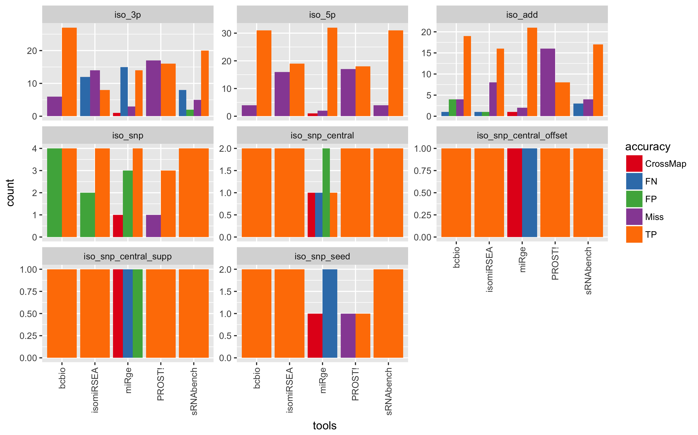

This comparison analysis is in beta version and number may change over time
until all the compatibility between tools and GFF format is finished.

Therefore, numbers are indicative and help to find possible bugs in the code.

Figures with the summary of the detected isomiRs are in `plot` folder.

The synthetic GFF used as reference is [here](synthetic/synthetic_100.gff) and
the [fastq](synthetic/synthetic_full_full.fq) file is available as well (adapter is TGGAATTCTCGGGTGCCAAGGAACTC).

This is the comparison with the synthetic data:

A simpler comparison is to considered any isomiR at 3' as iso_3p and
any isomiRs with snp as iso_snp_all:

To know which sequences doesn't agree with the synthetic data, use this file:
`all/summary.txt`:

* sample: file name related to the tool
* idu: unique sequence tag
* seq: sequence
* tag: `D` detected synthetic sequence in the file. `M` missed synthetic sequence in the file. `E` extra sequence not in synthetic data.
* same_mirna: whether miRNAs in the file is the same than in the synthetic data.
* iso_3p, iso_snp_central_supp, iso_snp_seed, iso_5p, iso_snp_central_offset, iso_add, iso_snp, iso_snp_central: 

`FP` when isomiRs is not in the synthetic data, but it is in the output file. The sequence is detected by the tool, but the tool doesn't report it like an isomiR.

`FN` when isomiRs is in the synthetic data, but it is NOT in the output file. The sequence is detected by the tool and reports an isomiRs but is not described like that in the synthetic data.

`TN` when isomiRs is NOT in the synthetic data, and it is NOT in the output file. Sequence is detected by the tool and reported correctly that there is NOT an isomiR of that type.

`TP` when isomiRs is in the synthetic data, but it is in the output file. Sequence is detected by the tool and reported correctly that there is an isomiR of that type.

`Miss` when the sequence is NOT detected by the tool.

`CrossMap` when the sequence is detected by the tool but another miRNA is assigned.

If you want to look for missed sequences for a specific tool, use sample to identify the tool and use `tag` to identify `M` values.

### Reproducibility [TODO]

Here it will go the command line used for the generation of the previous data.
